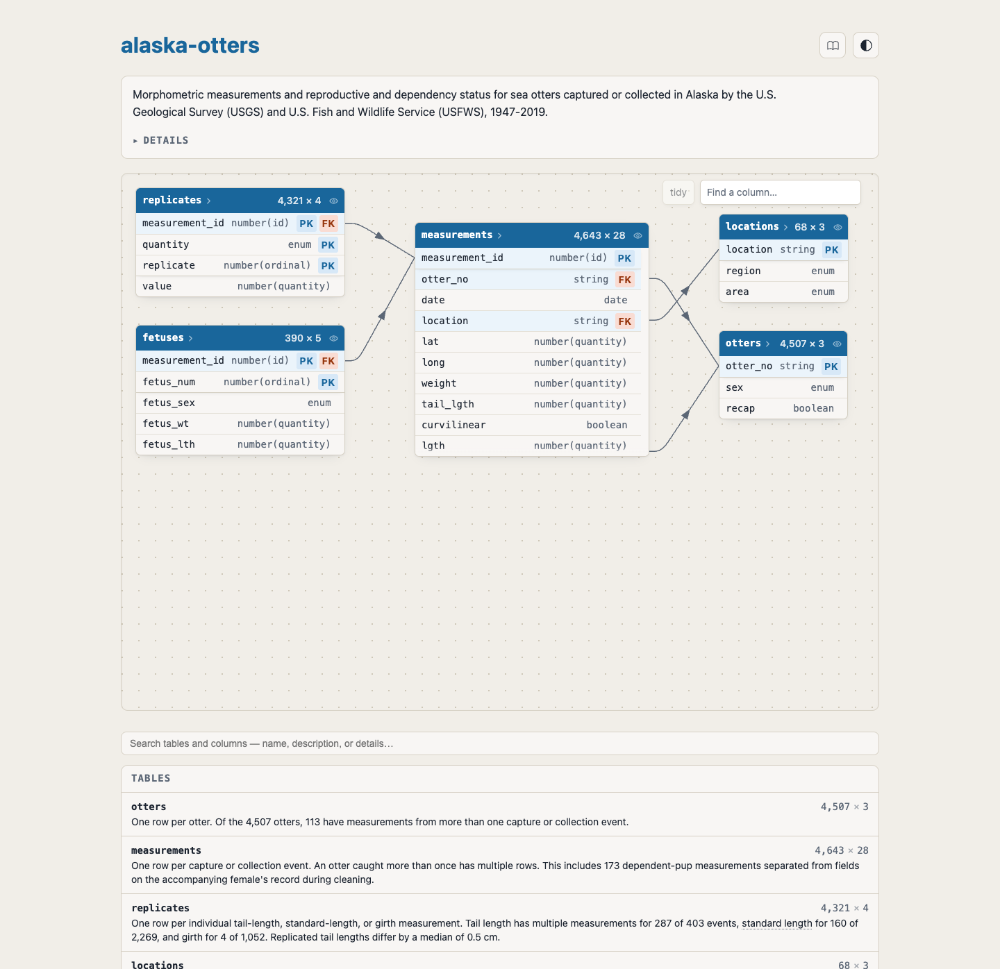
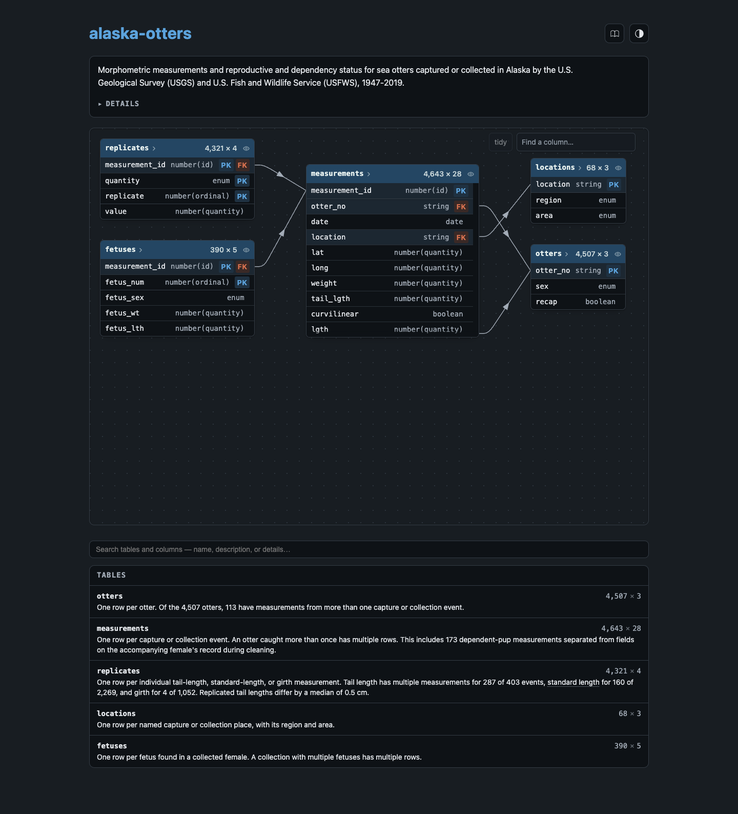

::: {.landing}

::: {.hero}

[Early preview — v](https://github.com/tidyverse/data-dict/releases){.pill}

<h1>A data dictionary your data can't disagree with.</h1>

A lightweight YAML spec for documenting related tables, and a CLI that validates your data against it. \
Built for humans and agents.

[Get started](quickstart.md){.btn .btn-primary .btn-lg} [See an example](examples/rendered/otters.html){.btn .btn-outline-primary .btn-lg target="_blank"}

:::

::: {.pitch}
data-dict is two things: a **specification** for data dictionaries (`data-dict.yaml`), and a **validator** (the `data-dict` CLI) that enforces it. The specification describes a collection of related tables: their contents, constraints, connections, and the specialised vocabulary you need to understand them. The validator turns that description into a data contract, checking that your data actually matches what the dictionary claims. This makes the dictionary a living document, accessible to both humans and agents, that tracks your shared understanding of a dataset as it evolves.
:::


::: {.feature-grid}

::: {.feature}
[**Validated, not just documented.** Check names, types, ranges and uniqueness against real data.](validate.md)
:::

::: {.feature}
[**Single binary.** No language run-times, no cloud; runs locally and in CI.](install.md)
:::

::: {.feature}
[**Polyglot.** Language-neutral; works for R, Python and SQL teams.](expressions.md)
:::

::: {.feature}
[**Diffable YAML.** Plain text you can version and review.](spec.md)
:::

::: {.feature}
[**Beautiful websites.** Browse tables, columns, relationships and glossary without reading YAML.](examples/index.qmd)
:::

::: {.feature}
[**Agent-ready.** Gives LLMs the context that currently lives in your head.](quickstart.md)
:::

:::

Ready to try it? [Install the CLI](install.md) in seconds, browse the [examples](examples/index.qmd) to see what a dictionary looks like, or read the [specification](spec.md) for the full details. Curious about the thinking behind the design? See the [design page](design.md).


## What a dictionary looks like

A dictionary is a single YAML file that the CLI renders as a browsable website. Here's an excerpt, abridged from the [otters dictionary](examples/otters.qmd):

::: {.panel-tabset}

## data-dict.yaml

```yaml
name: alaska-otters
tables:
  - name: otters
    source: { parquet: otters.parquet }
    description: One row per otter.
    columns:
      - name: otter_no
        type: string
        constraints: [primary_key]
      - name: sex
        type: enum
        values: { M: Male, F: Female, U: Unknown }
  - name: measurements
    source: { parquet: measurements.parquet }
    columns:
      - name: otter_no
        type: string
        constraints: [required, foreign_key]
```

## Rendered site

::: {.light-content}
[](examples/rendered/otters.html)
:::
::: {.dark-content}
[](examples/rendered/otters.html)
:::

:::

Three commands take you from data to dictionary:

```sh
data-dict draft otters.parquet
data-dict validate-data data-dict.yaml
data-dict render-spec data-dict.yaml
```

See the [quickstart](quickstart.md) for the full walkthrough, including how an AI agent can draft the dictionary for you. Or jump directly to the details of [the specification](spec.md) or look at more [examples](examples/index.qmd).

## Built for the agent era

There have been many previous attempts to encode data dictionaries in structured text. What makes data-dict different, and why revisit this problem now? AI fundamentally changes both the costs and benefits of a data dictionary:

* The costs of creating a data dictionary are lower, because AI agents can automate much of the boilerplate, including porting documentation from existing unstructured formats (`.doc`, `.html`, `.pdf`). `data-dict` bundles a creation skill to make this as easy as possible.

* The benefits are higher, because AI agents need the context that currently exists only in your head. Providing it via a data dictionary helps your AI tools work more accurately. `data-dict` bundles a reading skill that helps your agent make the most of it.

* The schema can be simpler because LLMs change what it means for something to be machine-readable. You only need to explicitly encode the most important structures, leaving more unusual quirks to free-form text.


## Install it now

::: {.panel-tabset}

## Shell

```sh
curl --proto '=https' --tlsv1.2 -LsSf https://github.com/tidyverse/data-dict/releases/latest/download/data-dict-cli-installer.sh | sh
```

## uv

```sh
uv tool install data-dict-yaml
```

## pipx

```sh
pipx install data-dict-yaml
```

## R

```r
pak::pak("tidyverse/data-dict/r")
datadict::dd_install()
```

:::

Or try it without installing anything:

```sh
uvx --from data-dict-yaml data-dict validate-spec data-dict.yaml
```

See the [installation page](install.md) for Windows, binary downloads, and building from source.

## Examples

::: {.example-grid}

::: {.example-card}
**otters** · 5 tables

Morphometric measurements of Alaskan sea otters, 1947–2019.

[YAML](examples/otters.qmd) · [Rendered site](examples/rendered/otters.html)
:::

::: {.example-card}
**contoso** · 8 tables

Synthetic retail sales for the fictional Contoso company, arranged as a star schema.

[YAML](examples/contoso.qmd) · [Rendered site](examples/rendered/contoso.html)
:::

::: {.example-card}
**dabstep** · 7 tables

Synthetic transactions from a payment processor.

[YAML](examples/dabstep.qmd) · [Rendered site](examples/rendered/dabstep.html)
:::

::: {.example-card}
**elevators** · 1 table

Registered elevator devices in New York City, from a 2015 FOIL request.

[YAML](examples/elevators.qmd) · [Rendered site](examples/rendered/elevators.html)
:::

::: {.example-card}
**foodbank** · 6 tables

Foundation Foods from the USDA FoodData Central (December 2025).

[YAML](examples/foodbank.qmd) · [Rendered site](examples/rendered/foodbank.html)
:::

::: {.example-card}
**loan-application** · 8 tables

Bank loan applications and the accounts behind them.

[YAML](examples/loan-application.qmd) · [Rendered site](examples/rendered/loan-application.html)
:::

:::

::: {.docs-panel}

## Learn more

::: {.docs-grid}

::: {.docs-col}
**Getting started**

* [Install](install.md)
* [Quickstart](quickstart.md)
* [Who, why and when](who-why-when.md)
* [Design](design.md)
:::

::: {.docs-col}
**Reference**

* [Specification](spec.md)
* [Validation](validate.md)

:::

::: {.docs-col}
**More**

* [Examples](examples/index.qmd)
* [Developer details](dev-validation.md)
* [GitHub](https://github.com/tidyverse/data-dict)
:::

:::
:::

:::
